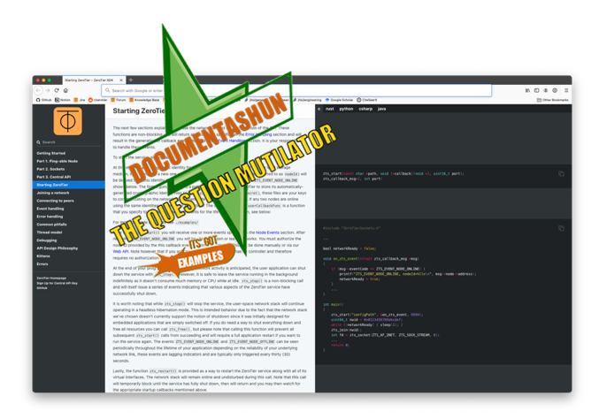

> It doesn’t matter how good your product is, because if its documentation is not good enough, people will not use it

## Examples

  - [Manual](http://10.6.6.250:8000/guides/manual/manual.html)
  - [SDK C/C++ Reference](http://10.6.6.250:8000/reference/libzt-c/html/)
  - [SDK Guide](http://10.6.6.250:8000/guides/libzt/#getting-started)

## What are we doing?

We are auto-generating all [four categories](https://diataxis.fr/introduction/) of documentation from markdown and source files.

- Tutorials
- How-to guides
- Explanation
- Reference

## Usage

 1. Edit your source material in `src/`
 2. Commit your changes -- Github actions will take care of the rest
 3. You're done. Now go do something else

## How it works

On each push, [.github/workflows/auto-commit.yml](.github/workflows/auto-commit.yml) triggers a rebuild of all documentation in the [src](./src) directory and outputs it to [dst](./dst). Language-specific tools are used to generate API reference documentation (stuff like Doxygen, javadoc, whatever). This covers the `Reference` category. Then, [slatedocs/slate](https://github.com/slatedocs/slate) is used to generate pretty tutorial-like guides. This covers the remaining three categories `Tutorials`, `How-to guides` and `Explanation`. The result is a set of trivially-hostable static html and javascript that we can dump in a small bucket somewhere. You can manually invoke a build of everything using `make` if you have docker and all of the required tools for your use-case.

Styling assets for the various tools are stored in `style/` and copied during and/or after builds.

## Add Your Project

 - Add build steps in [build.sh](./build.sh)
 - The `Makefile` just calls `build.sh`. I just like typing make, it rolls off the keyboard faster but I hate using make for anything complex.
