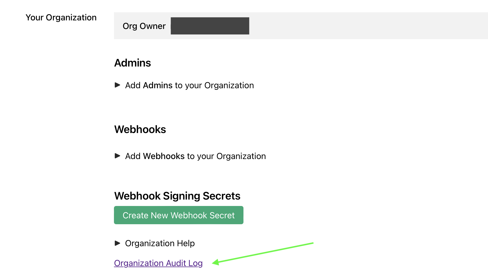
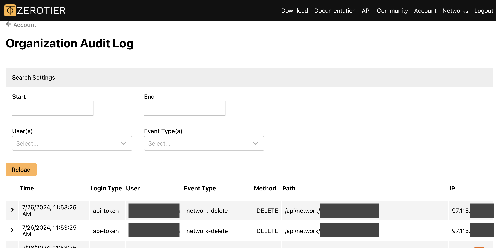

:::note
Audit Logs are a paid feature available to Essential and Commercial subscribers. Details about what we charge for and how to manage your subscription are available on the [pricing](/pricing) guide.

For an overview of current pricing and terms including suggested use cases, please see the [Pricing](https://www.zerotier.com/pricing) page on our website.
:::

You can view the full history of API requests made through Central to manage your ZeroTier networks using audit logs. We capture logs for the last 30 days of API traffic for every paid Central account, including requests made through both the Central dashboard and our [public API](/api/central).

To access your logs, scroll down to the Organization section of the [Account](https://my.zerotier.com) page and find the link labeled "Organization Audit Log".

On that page, you can see a list of the recent API requests that impacted any resources (networks, members, account settings) associated with your organization.

