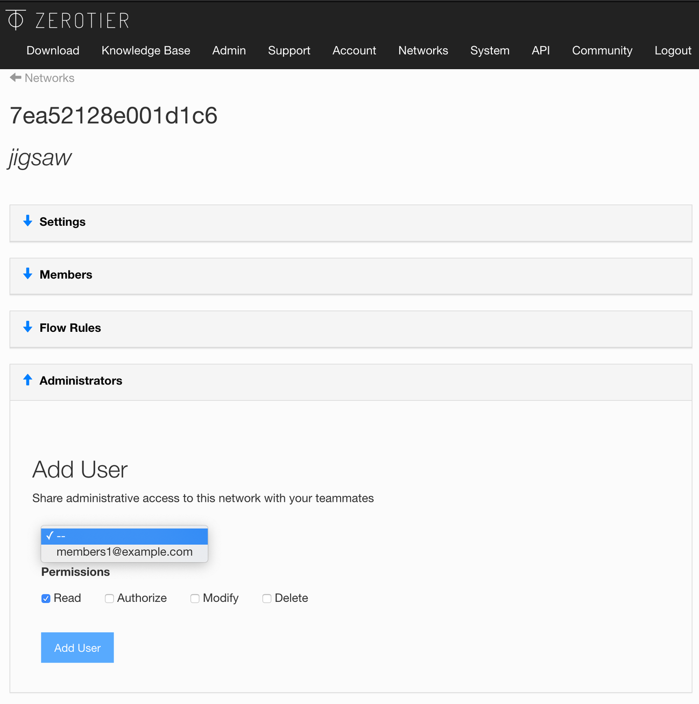

:::note
Multiple Admins are a paid feature available to Essential and Commercial subscribers. Details about what we charge for and how to manage your subscription are available on the [pricing](/pricing) guide.

For an overview of current pricing and terms including suggested use cases, please see the [Pricing](https://www.zerotier.com/pricing) page on our website.
:::

As a ZeroTier subscriber, you can invite additional administrators to manage their networks.

Toward the bottom of a Networks page there is a section titled "Administrators".

A user must be a member of your [Organization](./organizations.md) to become a Network Administrator.

### Permissions

You can allow another [my.zerotier.com](https://my.zerotier.com) user permission to

- **Read**. They can look at the network but not change anything
- **Authorize**. Allow them to Authorize new members, but not make other changes.
- **Modify**. Allow them to change any settings on this Network.
- **Delete**. Allow them to delete the network.
