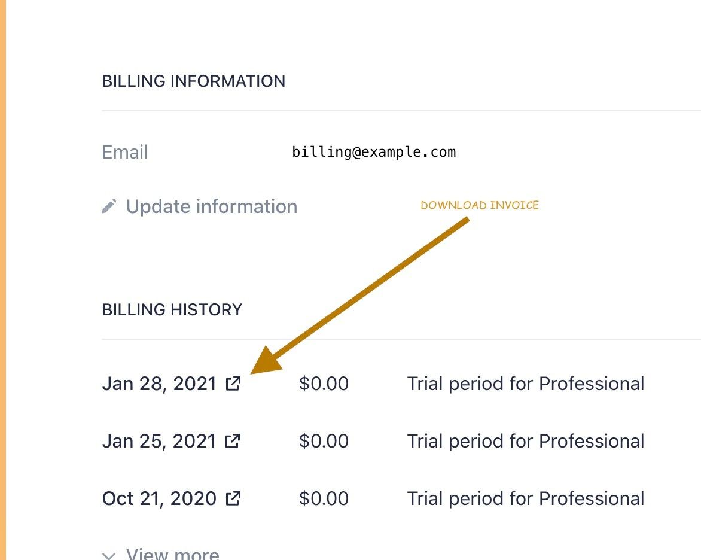

- Go to your [account page](https://my.zerotier.com/account)
- Click Manage Billing

It will take you to this page where you can update information and download invoices:

### I don't see a "Manage Billing" button

Only the Organization Owner can edit billing info. The account page will show who your Organization Owner is, if it is not you.

### If the address is incorrect on your invoice

Please use the Update Information link. If possible, use Address Line 1 for your company name. And Line 2 for your address. If it doesn't fit please contact us.

After changing the address, use the *download invoice* link. If too much time has passed since the invoice was finalized, it won't be updated. Sorry.

### My invoices don't show my Tax ID \#

ZeroTier's US Tax ID is 47-3126707. We aren't incorporated outside of the US so we don't have a Tax ID for anywhere outside of the US. Our payment processor will not print your Tax ID on invoices for this reason.

If you need a Tax ID in order to purchase ZeroTier, consider reaching out to a local MSP to buy ZeroTier through them.

### How to delete your whole account

Go to your [account page](https://my.zerotier.com/account) and click on the "delete account" button.

This deletes everything about your account, in accordance with various privacy laws.
