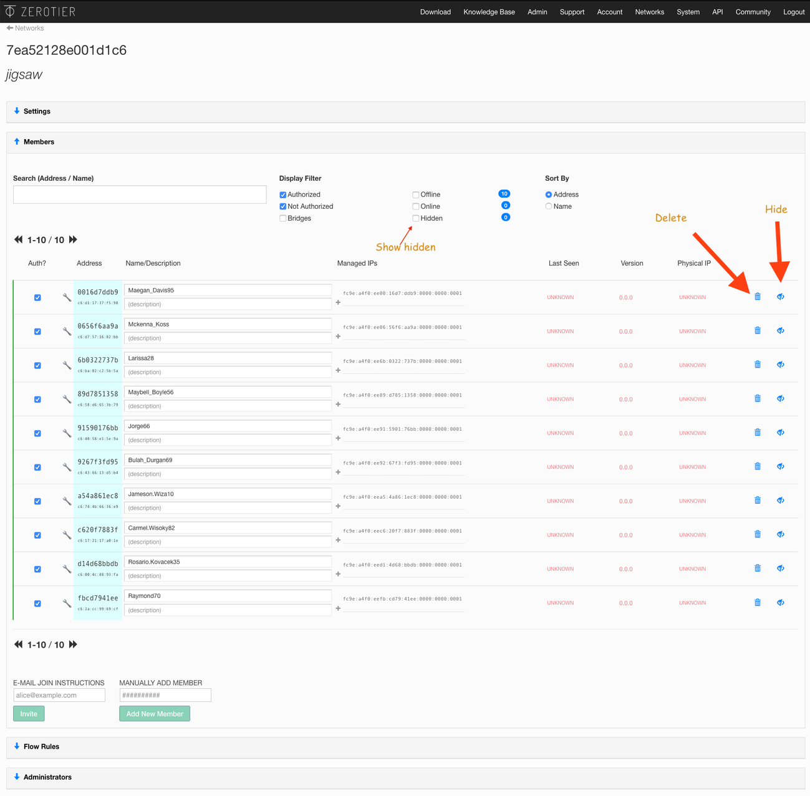
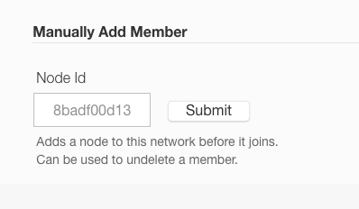
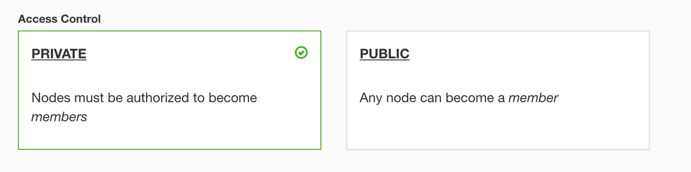

There are delete and hide buttons on the right side of the list nodes in the Members section of a ZeroTier network.

### Hiding a Member

The member will be de-authorized and hidden from view in the list.

Hidden members can be revealed by setting the "Hidden" checkbox above the member's list.

### Deleting a Member

The member will be de-authorized and completely removed from the list. It's a little more permanent than hiding.

### Recover a Deleted Member

You've deleted a member from your network, possibly by accident, and you want to get it back:

- Go to the Settings section of the network
- Find the Manually Add Member section
- Paste in the Node ID

If you've lost your Node ID, it can be viewed on the device in the ZeroTier app.

Delete should only be used if the node will never join again. Just de-authorize them instead if you don't want them counted against your node limits.

If you don't see the Delete and Hide Buttons, you have likely turned off your network's access control by setting it to Public.

Public networks have no access control. If you deleted or de-authorized a member it would reappear within a few seconds.

Set your network to back to Private.

