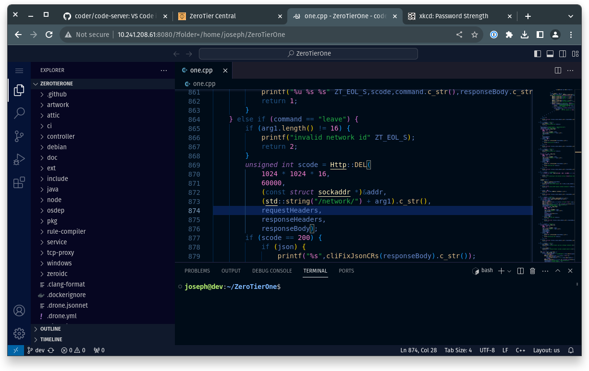
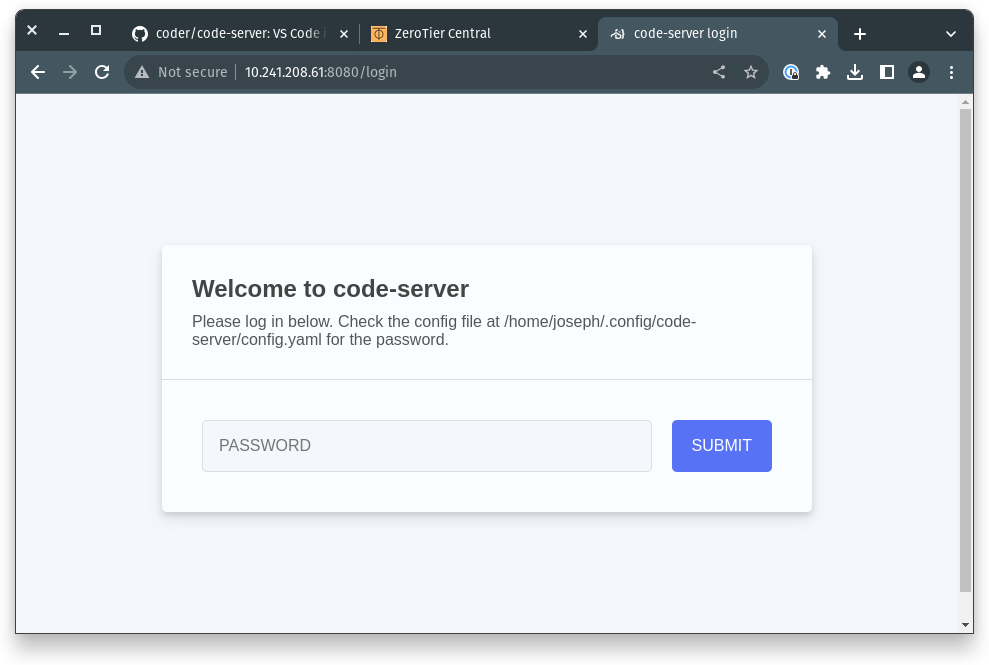

### What

`code-server` allows you to run an instance of VSCode in the browser and edit code on remote machines. Combining this with ZeroTier lets you do this securely across your virtual network. See their project page: [github.com/coder/code-server](https://github.com/coder/code-server)

### Install

```sh
curl -fsSL https://code-server.dev/install.sh | sh
```

### Configure

By default `code-server` will listen on `0.0.0.0`. We of course do not want to do this since we'd like to only access it over our secure ZeroTier network. To do this, open the config file:

```sh
nano /home/$USER/.config/code-server/config.yaml
```

Change your `bind-addr` to the ip address of the ZeroTier network interface for the network you'd like to access code-server over.

You can get this via [Central](https://my.zerotier.com) or from the `zerotier-cli`. For instance:

```sh
sudo zerotier-cli listnetworks
200 listnetworks <nwid> <name> <mac> <status> <type> <dev> <ZT assigned ips>
200 listnetworks 8156abe27c21623c intranet.joseph.com 31:26:27:43:19:fb OK PRIVATE ztcjyorbnc fd80:76c1:124c:2268:1da9:9bf1:14d:ab3e/88,10.241.208.61/16
```

```text
bind-addr: 10.241.208.61:8080
auth: password
password: correcthorsebatterystaple
cert: false
```

### Run

```sh
code-server
```

### Access Remotely

Now from another computer *that is also joined to the same ZeroTier network* open a browser and type in the node's address and port that is running code-server, you should be prompted to enter your password:



You're done!

:::caution
VS Code may state: `code-server is being accessed in an insecure context. Web views, the clipboard, and other functionality may not work as expected.`, this is true but as long as you've correctly set your `bind-addr` in the previous step your connection even over HTTP is secure since they are mediated over ZeroTier. Though we do recommend defense in depth so for sensitive situations we always suggest HTTPS.
:::
