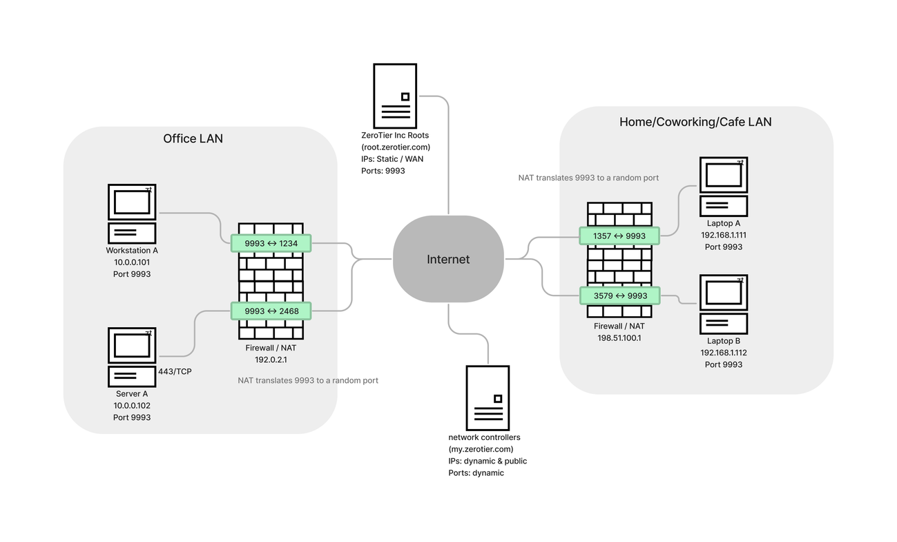

There are 3 classes of nodes in a working ZeroTier system: The roots, a controller, and your devices. Your devices need to be able to communicate directly with each other. ZeroTier uses UDP hole punching to do this. It's a similar process to VoIP STUN/TURN. The difficulty for strict firewall configurations is: the my.zerotier.com controllers and your devices are on dynamic IP addresses and are listening on random UDP ports.

Default zerotier-one listening ports are:

- 9993
- Secondary Port, randomized each start up and after being "offline" for too long.
- Random Port for UPnP and NAT-PMP (UPnP or NAT-PMP is not required for ZeroTier hole punching to work)

For best results, a device needs be able to send to any IP address, on any UDP port. If you allow outgoing source:9993 and incoming related return traffic, it'll probably work OK.

If the NAT type is "symmetric" or "strict" or "endpoint dependent mapping" (each vendor uses different terminology) NAT it will be difficult to make direct connections.

Look for Full Cone NAT, options related to VoIP, persistent NAT, Endpoint Independent Mapping, etc…

Ask your vendor. Let us know what works

Here's a table of the likeliness of a direct connection between two types of NAT:

|NAT type|Hard|Easy|None (WAN)|
|-|-|-|-|
|Hard|Very unlikely|Possible|Yes|
|Easy|Possible|Yes|Yes|
|None (WAN)|Yes|Yes|Yes|

And a network diagram:

## How do I know if I'm behind a Difficult NAT?

- Check zerotier-cli info -j and look at the surfaceAddresses. If that list is growing, you may be behind a difficult NAT.
- Check zerotier-cli peers and see if connections to peers you care about are "relayed"

:::tip
See also: [Router Configuration Tips](/routertips.md)
:::

## Vendor Specific Tips

### Palo Alto

If you are behind a Palo Alto, you will need some kind of ZeroTier bastion. As far as we know, there's no way to enable endpoint independent mapping. Contact us for help.

See [below](#i-cant-change-my-firewall-or-nat) for some ideas.

PAN-OS 10.1.7 and above have a [Persistent NAT feature](https://docs.paloaltonetworks.com/pan-os/10-1/pan-os-new-features/networking-features/persistent-nat-for-dipp). Please let us know if this improves your ZeroTier connections.

### OPNSense and pfSense

Nodes behind these BSD based firewalls will probably have trouble making direct connections with the default settings.
See [OPNsense article](/opnsense.md#static-port)

### Juniper

Use persistent NAT. See [forum post](https://discuss.zerotier.com/t/srx-nat-configuration-for-a-zt-appliance/6115)

### SonicWall

Commonly cause of relaying. We haven't seen the SonicWall UI in quite some time. The setting may be be called "Consistent NAT."

## I can't change my Firewall or NAT

Here are a few options:

### ZeroTier Router

One simple solution might be: statically port forward to one zerotier node, and use that node as a [route between zerotier and physical networks](/route-between-phys-and-virt.md).

### TCP relay

If your physical network won't let any UDP flow, host a TCP relay service somewhere physically close to your LAN. Maybe in a DMZ or in a datacenter in the same city.
See the [TCP Relay guide](https://github.com/zerotier/pylon?tab=readme-ov-file#reflect-dumb-tcp-relay)
