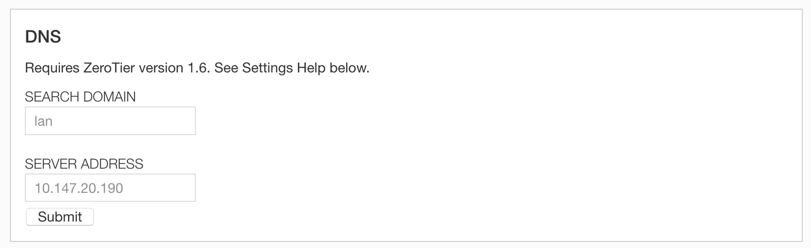
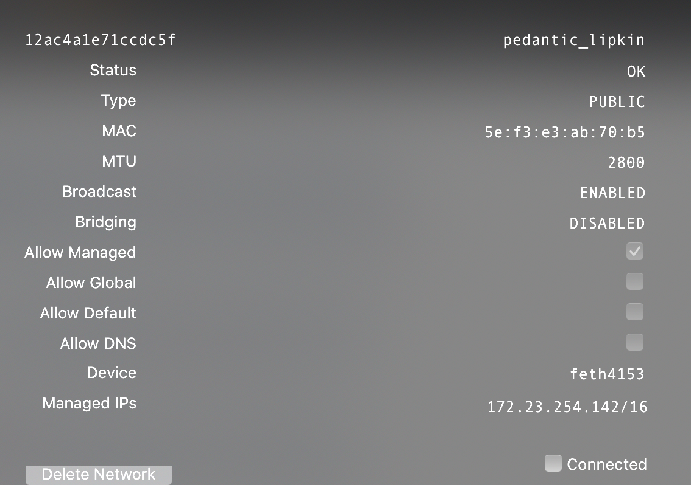

:::info
DNS integration is a long-requested feature. In 1.6 it is now possible to set DNS servers at the network controller that will be applied to the host upon joining the network, provided the host approves this by allowing managed DNS. This will allow networks to push things like Active Directory or other intranet DNS servers to members of a network.

This still doesn't let you simply address hosts by their name as configured at the controller, but we're aware of this. We plan on adding a feature to allow the controller itself to be a DNS server too if one desires in a future ZeroTier version (likely post-2.0).

In the mean time, have a look at [GitHub - zerotier/zeronsd: A DNS server for ZeroTier users](https://github.com/zerotier/zeronsd), a DNS server for your [ZeroTier Central](https://my.zerotier.com) networks.
:::

ZeroTier managed DNS is currently only supported on Windows, macOS, Android, and iOS. Linux support is forthcoming but may be limited to common Linux DNS resolver configurations such as those found in Debian and CentOS/RHEL.

Configuration is done at the [my.zerotier.com](https://my.zerotier.com) network settings:



Each client must click the "Allow DNS" button.



### Windows Active Directory

Some group policies can prevent managed DNS from working.

If your machines are all domain joined, you can push a `NRPT` rule via GPO. Go to Computer Config → Policies → Windows Settings → Name Resolution Policy.

See here [New DNS Features don't appear to work](https://discuss.zerotier.com/t/new-dns-features-dont-appear-to-work/982/7) for more discussion.

### macOS DNS resolution

On macOS, common command line DNS tools like dig, host, and nslookup don't know about these types of resolvers, and do not work with ZeroTier Managed DNS.

Here are some macOS specific alternatives:

```sh
dns-sd -G v4v6 host.example.com
dscacheutil -q host -a name host.example.com
ping and curl should work too.
```

### Alternatively

It's also possible to put your ZeroTier Managed IP Addresses in public DNS. That is, purchase a domain name from a registrar and create A and/or AAAA records that point to your virtual IP addresses.

:::tip
[See community threads about DNS](https://discuss.zerotier.com/search?q=dns)
:::
