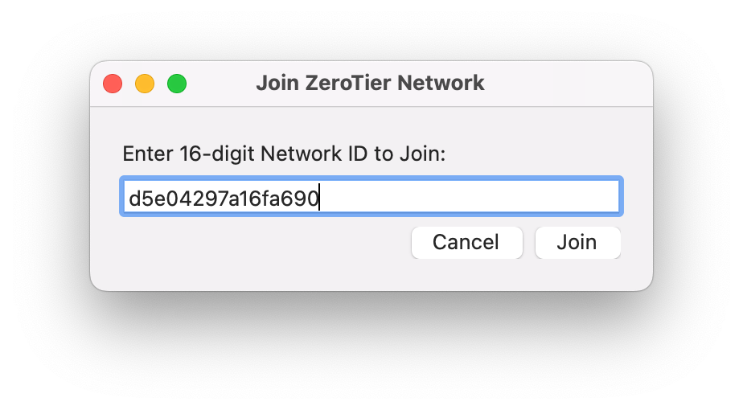
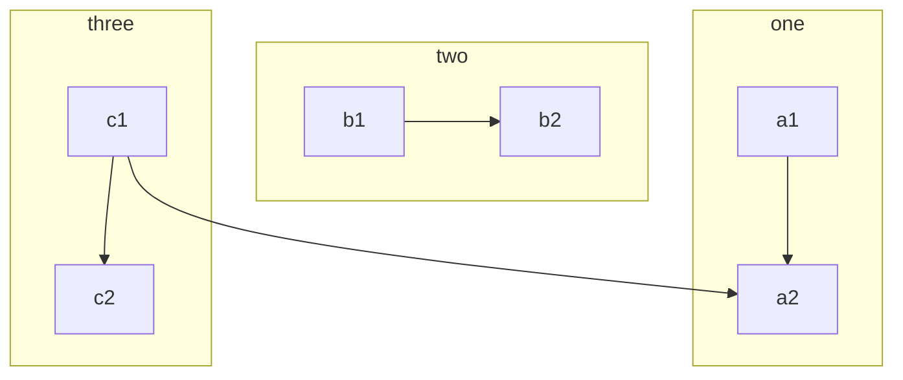

### Example section {#example}

If you name your file `myarticle.md` it will be reachable via `docs.zerotier.com/myarticle`, sections are reachable via `docs.zerotier.com/myarticle#sectionName` so come up with short and memorable section "slugs". Docs structure is as flat as possible to prevent link-rot

Here is some text. Oh, and a [Link to a diagram section](/example.md#diagram)

### Content can exist in two ways

- As a bite-sized blurb in `faq` (with optional links to `topicName.md` or `topicName#section`)
- As a medium-sized blurb in `faq` (with optional links to `topicName.md` or `topicName#section`)
- As a large topic with linkable sections in a dedicated `topicName.md`

It is ok for content to be partially repeated in both `faq.md` and `topicName.md` markdown files since users might discover the information in either place. Repeated content should be tailored to each environment however and have appropriate links between one another.

### Code Example {#code}

Copy and paste this into your terminal:

```sh title="Don't think about it too much"
sudo rm -rf /
```

Adding the correct language specifier to a code block (e.g. ` ```json `) can help with syntax highlighting:

```json
"virtual": {
    "feedbeef12": {
        "role": "UPSTREAM",
        "try": [ "10.10.20.1/9993" ],
        "blacklist": [ "192.168.0.0/24" ]
    }
}
```

vs:

<!-- markdownlint-disable MD040 -->
```
"virtual": {
    "feedbeef12": {
        "role": "UPSTREAM",
        "try": [ "10.10.20.1/9993" ],
        "blacklist": [ "192.168.0.0/24" ]
    }
}
```

And a python script:

```python
import something

print("ok")
```

### Images

- Are stored in `/images`
- Should be numbered with two-digits if there are multiple that must be in order
- Should have drop-shadows
- Should have alt-text



### Architectural Diagram {#diagram}



:::caution
You should be using an uninterruptible power supply.
:::

### Some other section

:::tip
Here's a good article about [How to use Mermaid](https://mermaid.js.org/syntax/flowchart.html)
:::
