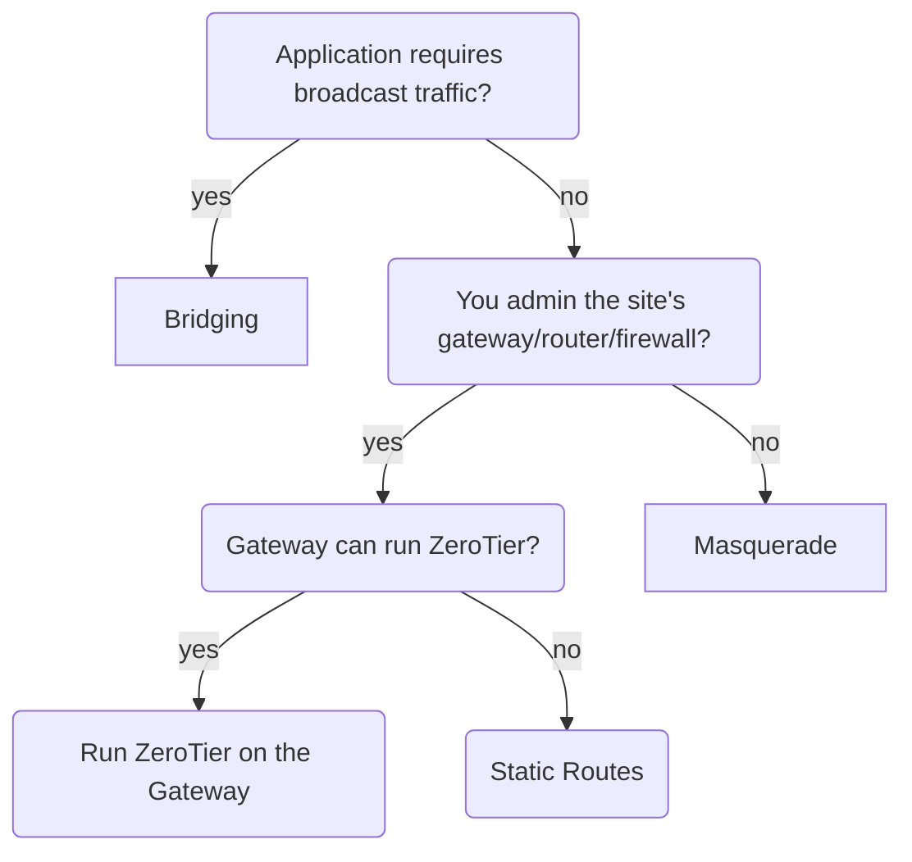
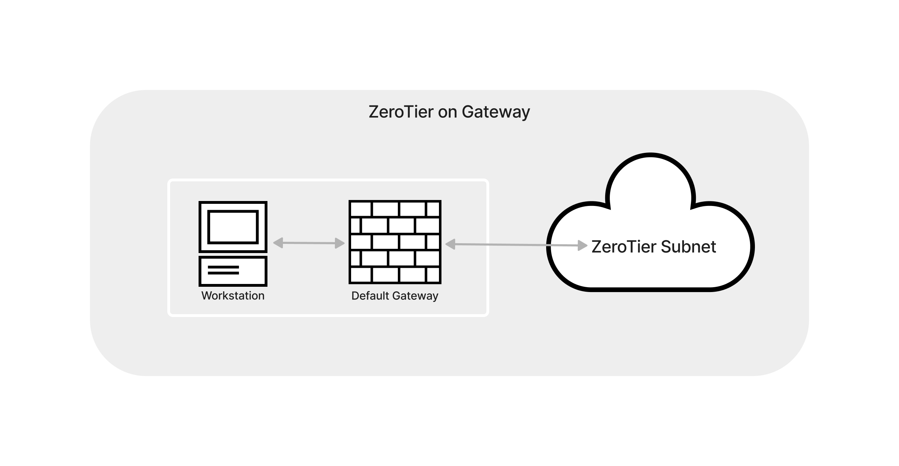
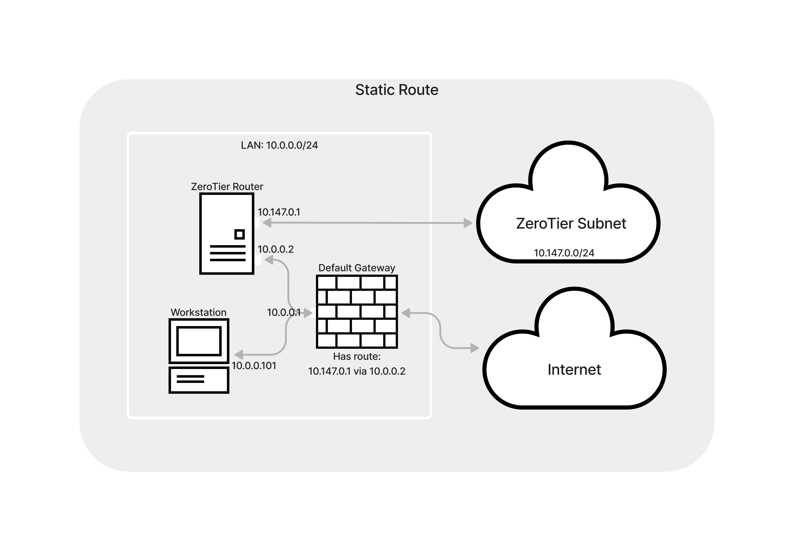
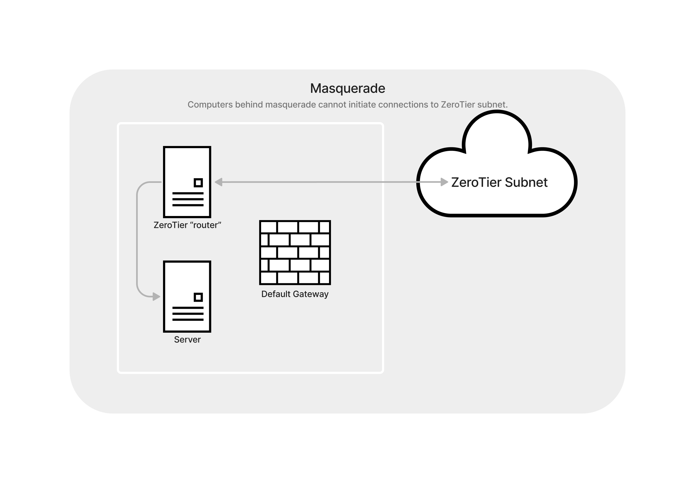
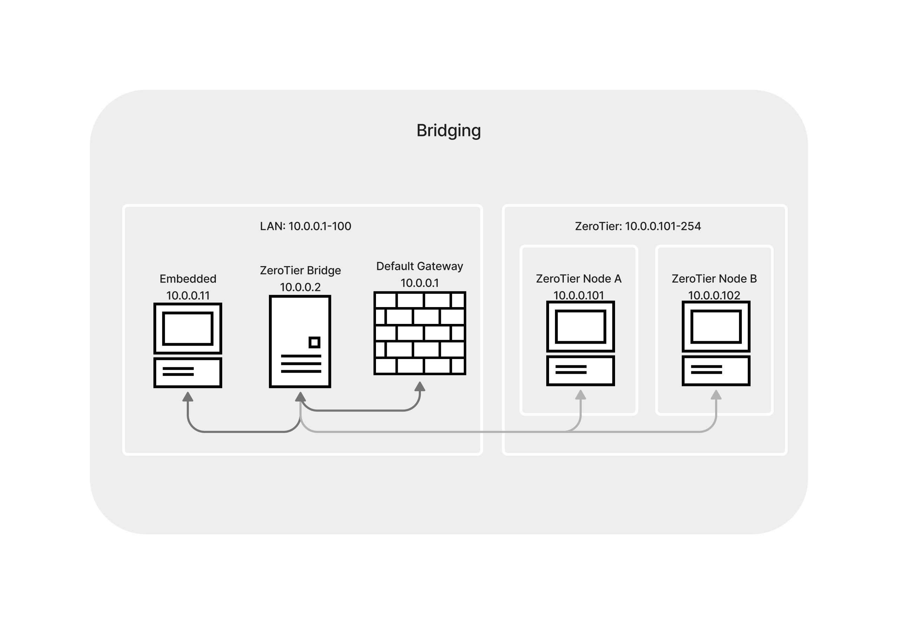

ZeroTier creates networks interfaces, IP addresses, and routes on your computers. Because of this, you can use all the standard networking tools and techniques with your ZeroTier networks. 

There are 2 main ways to connect your ZeroTier networks to your Physical networks: Routing and Bridging. Yeah, they are technically different things.  Bridging has its downsides, including that it's tricky to set up. 

## Routing or Bridging?

Most of the time, choose routing. 

Do you have devices that can't install zerotier, use broadcast or multicast, and need to talk to ZeroTier nodes? Then consider bridging. 

## Routing
There are many ways to set up routing.

We have only a [Masquerade Tutorial](route-between-phys-and-virt) so far, but the steps are the same for any of these set ups; just skip the IPTables Masquerade step.

Here are some of the common examples:

### Router can run ZeroTier

This is the best case. Since the router/firewall is the default gateway, no additional routing config needs to be done. It already knows the routes to the ZeroTier networks it's joined to. 

Some examples:

- Mikrotik
- Teltonika Networks
- OpenWRT
- OPNsense

If you aren't already using existing routers, consider one of these!

### Router can't run ZeroTier

You'll have to run ZeroTier on a device or virtual machine in your LAN. You should use Linux if at all possible. This will act as the "router" between ZeroTier and Physical networks.

### Static Routes on Gateway

Add a Static Route to your router/gateway: 

`[ZeroTier subnet] via [LAN IP of ZeroTier "router"]`

For example:

`10.147.20.0/24 via 10.0.0.2`

### Masquerade

This is the same method that your home router uses to route between Internet and your home LAN. 
See the [Masquerade Tutorial](route-between-phys-and-virt)
    

## Bridging

See the [Bridging Tutorial](bridging)

Some things that use broadcast:

### Wake on LAN
Since ZeroTier is a program that runs on your computer, if the computer is off, it won't be able to receive ZeroTier packets. Wake on LAN packets need to be on the physical network. 
You still might not need Bridging if this is your only requirment: Run ZeroTier on a different computer on your LAN, and send the WoL packet from that computer. 

### Auto-discovery

Does your equipment come with a companion desktop or mobile application that auto-discovers the hardware on the network? This process usually uses broadcast.
If the app lets you type in an IP address in the settings instead of using auto-discovery, that might be easier. 

Mobile Operating Systems don't let you do broadcast over a "VPN" connection. You need run a bridge wherever the equipment is, _and_ where the phone or tablet is. 

### Embedded equipment
- Industrial 
- Audio / Video / Lighting equipment
- Cameras

_Sometimes_ these devices blast control traffic or actual data via broadcast.

