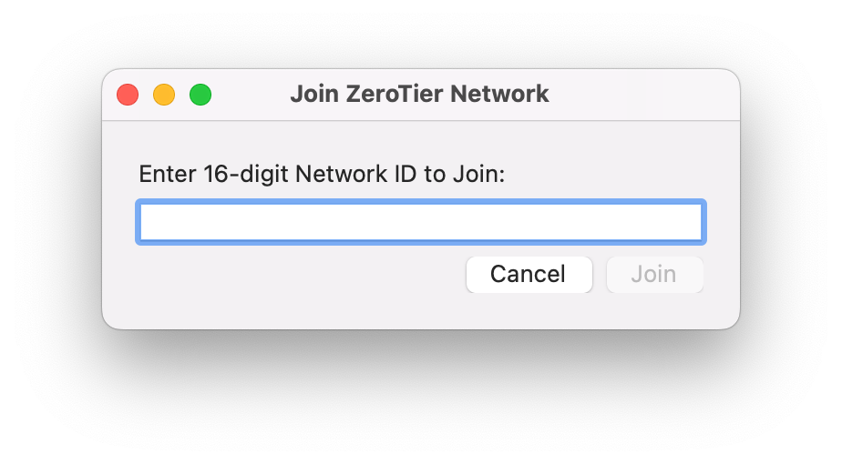

Joining happens from a device, after installing ZeroTier One. You can join your own networks and other people's networks.

### macOS and Windows

On macOS and Windows, find the ZeroTier app in your menu bar. Launch the ZeroTier One app bundle if it's not already running. Click the ⏁ icon on your menu bar and select 'Join New Network'.

Type or paste in your network ID and hit 'Join Network'

### From the Command Line

From the command line simply type zerotier-cli join ################ with ############### being the 16-digit network ID of the network you wish to join.

On UNIX based OSes, this requires sudo. On Windows, this requires an administrator command prompt.
