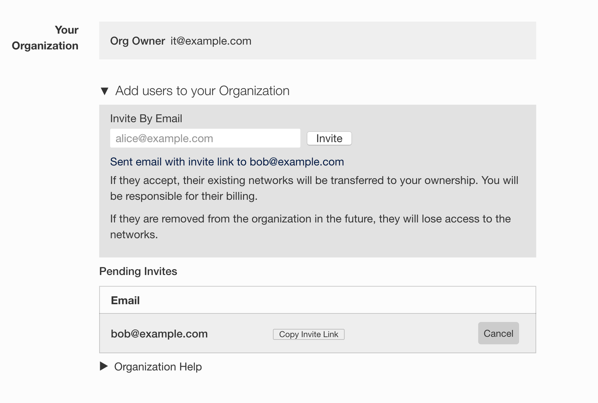
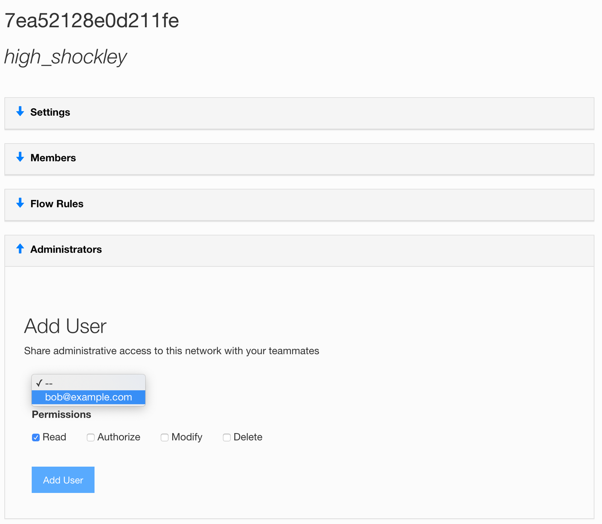
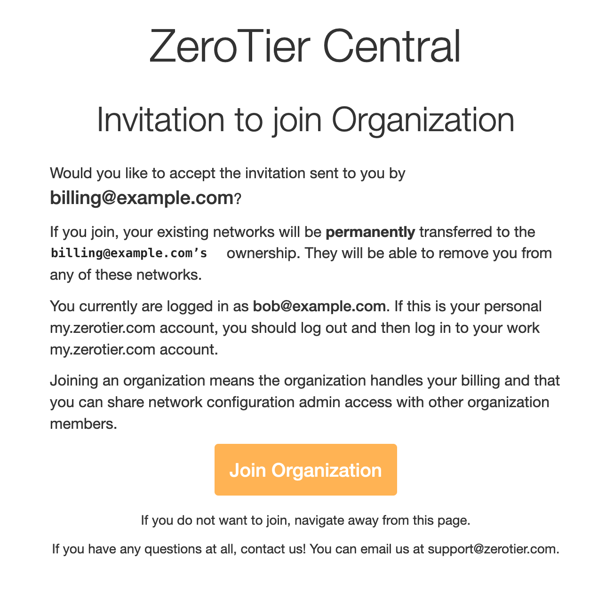

You've subscribed to my.zerotier.com and want your coworkers to also have the benefits of a Pro account.

Add them to your Organization by going to my.zerotier.com/account

Create an invite by typing in an email address

We will email them the link. You can also paste it into your company chat.

Once they accept the invite, they can be added as Admins to individual networks.

The invited User will see:

### Removing Admins from the Organization

You can click the "remove" button next to their name in the list of admins. They will lose Admin access to the organizations networks.

### Change the Organization owner

There is currently no straight-forward way to do this, and ZeroTier support can't change your organization owner via email/ticket because that would be insecure.

The secure way to do this is to change the login of the organization owner:

- Go to <https://my.zerotier.com/account>
- click Manage Account
- Click Personal Info
- Change the email address to the new organization owner's email
- Log out and back in
- You may want to change the password as well

Consider using a general email address like "<billing@example.com>" or "<zerotier@example.com>" when you sign up, or when you change org owners.

:::note
If the target email address already has an account at https://my.zerotier.com, that account must first be deleted.
:::

#### Can I move or transfer my network(s) to another user?

The only process that moves networks is joining an organization. When you join, the organization absorbs all your existing networks.

If your networks are small; It may be faster to start a new account and new networks.
