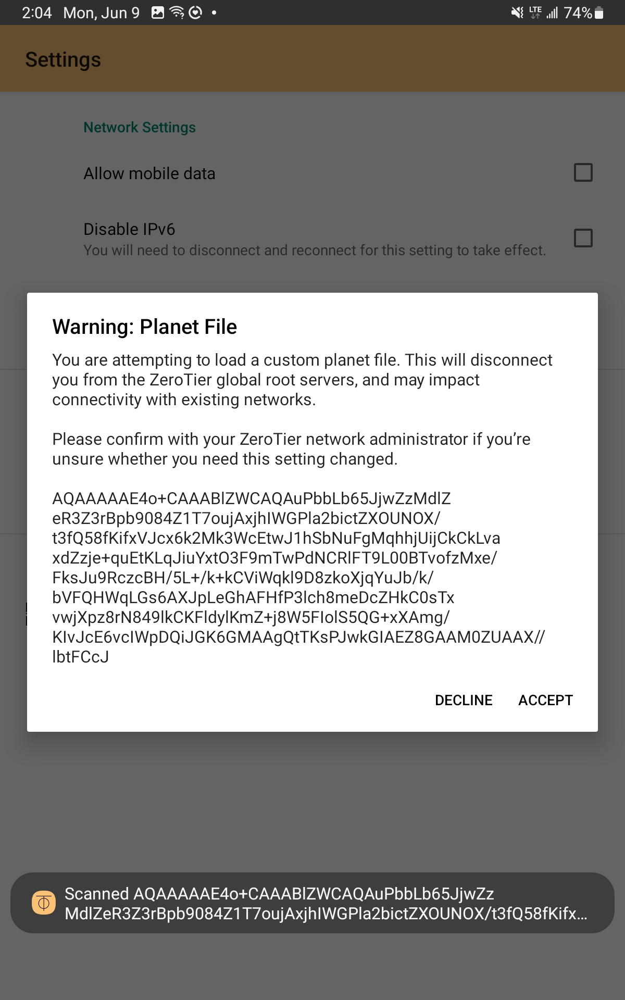
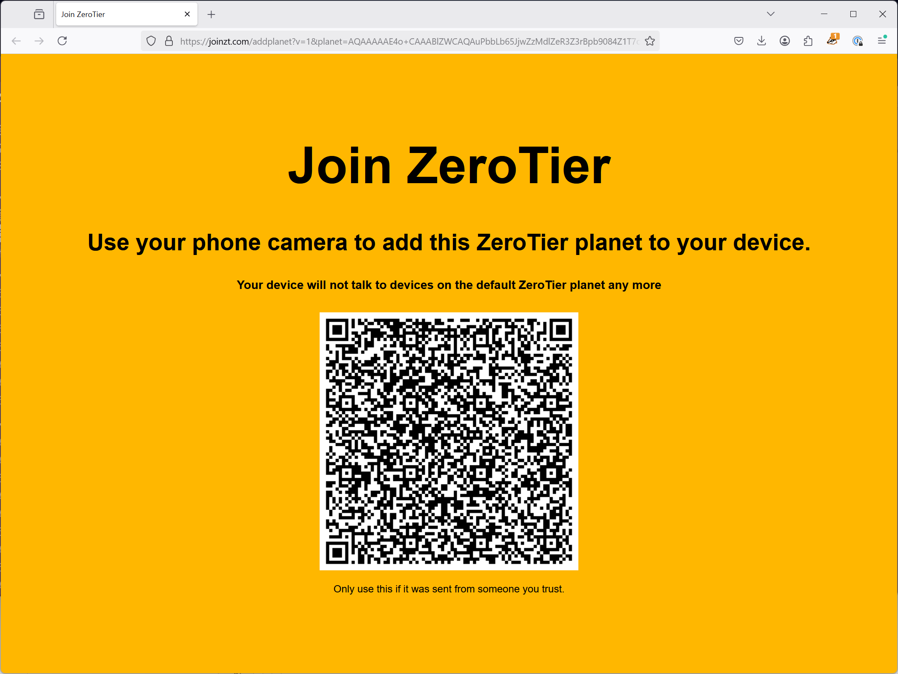
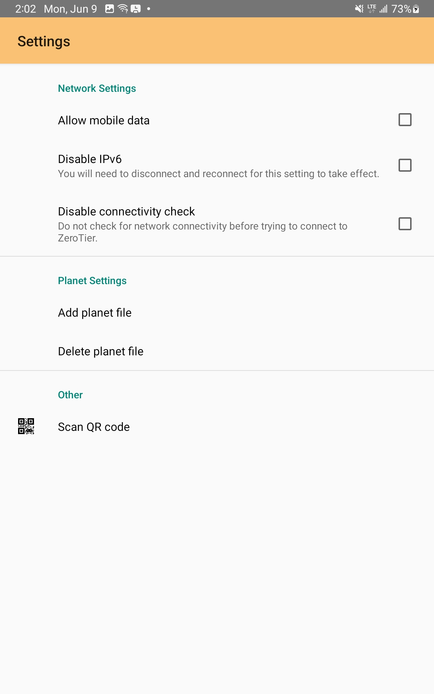
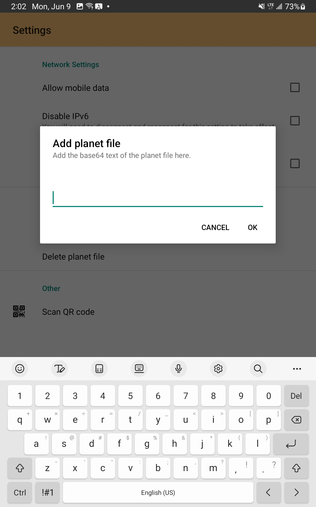

:::warning
Using moons is an advanced configuration for ZeroTier One. In addition, any
commercial use of self-hosted infrastructure is subject to our [license terms](https://github.com/zerotier/ZeroTierOne/blob/dev/LICENSE.txt).

If you expect to use custom moons for production usage, we highly
recommend that you reach out to our [support team](mailto:support@zerotier.com)
help planning your deployment.
:::

Devices connected to a ZeroTier One network need to be able to locate and
authenticate each other by using a shared set of root servers. By default,
clients use a default pool of global root servers deployed and maintained
by ZeroTier, Inc.

However, because roots are occasionally overloaded, and may not be located
close (in terms of network hops) to your workload, you may be able to gain
more reliable performance, especially when traffic is being relayed, by
deploying your own servers to augment our roots. We call these supplementary
root servers "moons".

:::info
The roots and moons a collection of nodes connect to effectively defines the
"global datacenter" they're located in. You can actually deploy an entirely
separate set of roots and disconnect your clients from the default pool,
forming an "air-gapped" deployment. This requires customization of the
clients themselves, as well as running high-available root infrastructure.
The instructions below instead focus on adding "moon" servers which can
improve the performance and reliability of your deployment while still taking
advantage of the shared infrastructure we support.
:::

In ZeroTier One version 1.2.0 we introduced the ability to add your own
user-defined roots. The logical data center we inhabit is known as a
"planet", a user-defined set of roots is called a **moon**. When a node
"orbits" a moon, it adds the moon's roots to its root server set. Nodes
orbiting moons will still use planetary roots, but they'll use the moons
if they look faster or if nothing else is available.

## Planning Your Deployment

The first step in creating a moon is to deploy a set of root servers. In
most cases we recommend two. These are regular ZeroTier nodes, but ones
that are always on and have static (physical) IP addresses. These static
IPs could be global Internet IPs or physical intranet IPs that are only
reachable internally. In the latter case your moons won't work
outside your office, but that doesn't matter. Roaming nodes will just
use planetary roots instead.

We recommend that root servers do not act as network controllers, join
networks, or perform any other overlapping functions. They need good
reliable network connections but otherwise require very little RAM,
storage, or CPU. A root could be a small VM, VPS, or cloud instance, or
a small device like a [Raspberry Pi](https://www.raspberrypi.org/). If
you provision your moons as VMs, take care that they do not all reside
on the same physical hardware. This would defeat the purpose of having
two.

## Creating a Moon Configuration

The next step is to create a world definition using `zerotier-idtool`.
You will need the `identity.public` files from each of your moon
servers. Pick one root (doesn't matter which) and run
`zerotier-idtool initmoon <identity.public of one root> >>moon.json`.
The `zerotier-idtool`command will output a JSON version of your world
definition to *stdout*, so we redirect it to `moon.json`.

Examine this file. It will contain something like:

```json

    {
      "id": "deadbeef00",
      "objtype": "world",
      "roots": [
        {
          "identity": "deadbeef00:0:34031483094...",
          "stableEndpoints": []
        }
      ],
      "signingKey": "b324d84cec708d1b51d5ac03e75afba501a12e2124705ec34a614bf8f9b2c800f44d9824ad3ab2e3da1ac52ecb39ac052ce3f54e58d8944b52632eb6d671d0e0",
      "signingKey_SECRET": "ffc5dd0b2baf1c9b220d1c9cb39633f9e2151cf350a6d0e67c913f8952bafaf3671d2226388e1406e7670dc645851bf7d3643da701fd4599fedb9914c3918db3",
      "updatesMustBeSignedBy": "b324d84cec708d1b51d5ac03e75afba501a12e2124705ec34a614bf8f9b2c800f44d9824ad3ab2e3da1ac52ecb39ac052ce3f54e58d8944b52632eb6d671d0e0",
      "worldType": "moon"
    }
```

The world ID is technically arbitrary and could be any random 64-bit
value. By convention we use the ZeroTier One identity of one of the moon servers.

The world definition JSON file **contains secrets**, so it's important
to keep it in a safe place. The `signingKey_SECRET` is what will allow
you to update your world definition automatically in the future.

Now add your other moons(s) and define their stable endpoints. You'll end
up with something that looks like:

```json
    {
      "id": "deadbeef00",
      "objtype": "world",
      "roots": [
        {
          "identity": "deadbeef00:0:34031483094...",
          "stableEndpoints": [ "10.0.0.2/9993","2001:abcd:abcd::1/9993" ]
        },
        {
          "identity": "feedbeef11:0:83588158384...",
          "stableEndpoints": [ "10.0.0.3/9993","2001:abcd:abcd::3/9993" ]
        }
      ],
      "signingKey": "b324d84cec708d1b51d5ac03e75afba501a12e2124705ec34a614bf8f9b2c800f44d9824ad3ab2e3da1ac52ecb39ac052ce3f54e58d8944b52632eb6d671d0e0",
      "signingKey_SECRET": "ffc5dd0b2baf1c9b220d1c9cb39633f9e2151cf350a6d0e67c913f8952bafaf3671d2226388e1406e7670dc645851bf7d3643da701fd4599fedb9914c3918db3",
      "updatesMustBeSignedBy": "b324d84cec708d1b51d5ac03e75afba501a12e2124705ec34a614bf8f9b2c800f44d9824ad3ab2e3da1ac52ecb39ac052ce3f54e58d8944b52632eb6d671d0e0",
      "worldType": "moon"
    }
```

The static IP addresses you use must be reachable from all the places
you want these moons to serve. If you're deploying these for use at a
physical location, use internal IPs. If you want them to be usable
off-site, use public IPs from your DMZ or host them at a cloud provider
with a data center presence close to you. Low-cost cloud hosts that
provide simple static direct IP addressing and dual-stack IPv4/IPv6
support like [Digital Ocean](https://digitalocean.com/),
[Vultr](https://vultr.com/), and [Linode](https://linode.com/) make
effective places to host moons. The lowest priced instances at these
providers are more than sufficient in most cases.

## Configuring Your Moon Servers

The final step in configuring your moons is to generate a signed "world" with
`zerotier-idtool genmoon moon.json`. In this case this will generate a
file called `000000deadbeef00.moon`. This does not contain secret keys
but is signed by the secret from the JSON file.

Now go to your moons, create (if it does not exist) a subdirectory of
their working directories (usually `/var/lib/zerotier-one` on Linux)
called `moons.d`, and copy the signed moon file there. Now restart the
ZeroTier One service on each moon; after that, they should be ready!

## Configuring Your Clients

Each ZeroTier One peer that uses these moons will need to be configured to
use them in addition to the default, global roots.

### Desktop / Server

For systems running the full ZeroTier One agent, you can proceed in either of two ways:

#### Option 1: Copy the same world definition file to the service data directory

Custom world definitions are loaded from the `moons.d` subdirectory of
the service data directory. See the full list of
[config file paths](/config.md#system) for the appropriate location on
your system.

As with the moon servers themselves, after you add the signed planet file
to the `moons.d` directory you should restart the service.

#### Option 2: Use the `zerotier-cli orbit` command

You can directly add the new moon via the `orbit` CLI subcommand:
`zerotier-cli orbit deadbeef00 deadbeef00`.

The first argument is the
world ID (which we can shorten by removing the two leading zeroes) and
the second is the address of any of its moons.

After that, restart the client. It will attempt to contact your moon(s)
and obtain the full world definition from it if it's online and
reachable.

Once you've "orbited" your moon, try `zerotier-cli listpeers`. You
should see the moons you've created listed as `MOON` instead of `LEAF`.
They will now be used as alternative root servers.

### Mobile

Mobile clients must be configured through the UI or opening a specially-formatted
URL. In either case, you'll need to base64-encode the binary planet file; save
this for use in one of the cases below.

#### Option 1: Create and send a "custom moon" URL

Starting in version 1.16.0, ZeroTier One mobile clients provide support for loading
planet files via custom URLs. This relies on the same custom link mechanism
that allows for network invite sharing via QR code. Use the following URL template
to pass along a QR code to clients:

`https://joinzt.com/addplanet?v=1&planet=$base64_planet_file`

<div style={{ width: "48%" }}>

</div>

If you load a URL of the above form in a desktop web browser, it will display a static page with a scannable QR code. On a mobile device with the ZeroTier One client installed, it should open a prompt asking if you want to save and use the new planet configuration.


#### Option 2: Transfer the planet file to the device directly

You can also pass along the base64-encoded planet file as text via email, shared
note, or file sync. Whatever method you choose, you'll need to copy the full file
to the system clipboard.

After that, open the in-app "Settings" UI and select "Add Planet File" per the screenshots below and then confirm.
<div style={{ float: "left", width: "48%" }}>

</div>
<div style={{ float: "right", width: "48%" }}>

</div>
