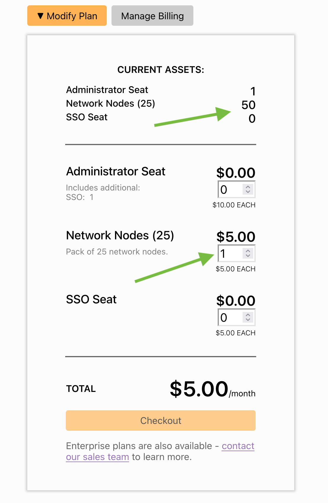
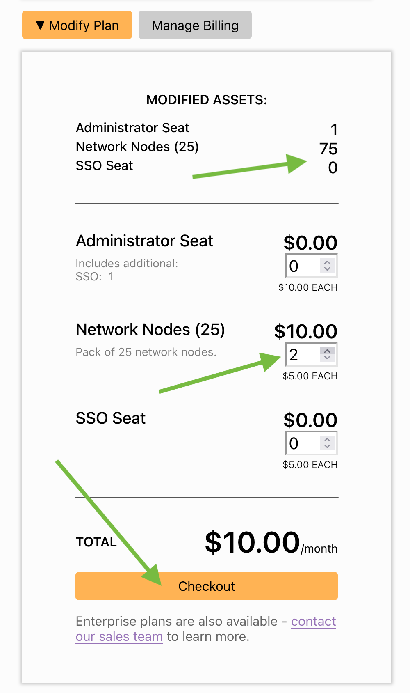

If you are already on the Pro plan, to increase your Node, Admin, or SSO entitlements:

Go to the Account page

Click Modify Plan

You will see your current subscription level

Adjust the levels to your new needs

Click checkout

The system will figure out any needed credits or proration.

Click Update Subscription to finish to accept the changes

This will charge your card if needed and update your account to the new subscription levels.
