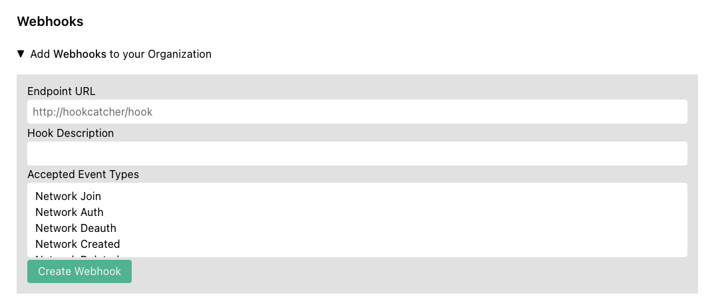
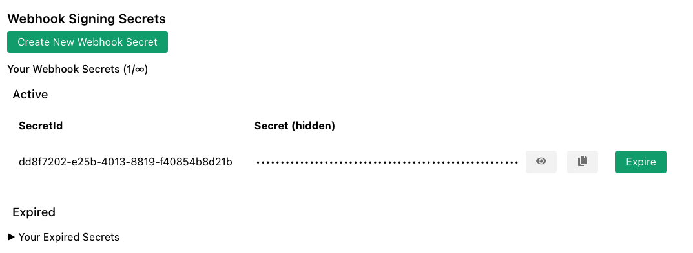

Subscribers can receive notifications of changes to their networks, network members, and organizations on [my.zerotier.com](https://my.zerotier.com) via Web Hooks.

## Configuring Web Hooks

Go to the [Account](https://my.zerotier.com/account) page.  Under `Your Organization` there is a section called `Webhooks`.



Enter the URL your HTTP(S) endpoint that will receive the webhook and (optionally) enter a description, then select the event types you wish to receive on the webhook.

See [github.com/zerotier/ztchooks](https://github.com/zerotier/ztchooks) for example code for receiving & processing webhooks.

All hooks fired will contain the following three fields:

```json
{
    "hookd_id": ...,
    "org_id": ...,
    "hook_type": ...,
}
```

The rest of the fields vary by `hook_type`.  Full definitions of all of the fields can be found [here](https://github.com/zerotier/ztchooks/blob/main/types.go).


## Hook Types

* Network Join (`NETWORK_JOIN`) - Fired when a new member is requesting to join a network.  NOTE: This is only fired once when the network controller first receives the join request from the network member.

* Network Auth (`NETWORK_AUTH`) - Fired when an administrator authorizes a new member to a network.

* Network Deauth (`NETWORK_DEAUTH`) - Fired when an administrator revokes authorization from a network.

* Network Created (`NETWORK_CREATED`) - Fired when an administrator creates a new network.

* Network Deleted (`NETWORK_DELETED`) - Fired when an administrator deletes a network.

* Network Configuration Change (`NETWORK_CONFIG_CHANGED`) - Fired when an administrator changes the configuration of a network.

* Network SSO Login (`NETWORK_SSO_LOGIN`) - Fired when a user is authorized/reauthorized to a network via SSO.

* Network SSO Login Error (`NETWORK_SSO_LOGIN_ERROR`) - Fired when there is an error authorizing/reauthorizing to a network via SSO.

* Member Configuration Change (`MEMBER_CONFIG_CHANGED`) - Fired when an administrator makes a configuration change to a network member.

* Member Deleted (`MEMBER_DELETED`) - Fired when an administrator deletes a network member.

* Organization Invite Sent (`ORG_INVITE_SENT`) - Fired when the account owner invites an administrator to the network.

* Organization Invite Accepted (`ORG_INVITE_ACCEPTED`) - Fired when the invitee accepts and joins the organization.

* Organization Invite Rejected (`ORG_INVITE_REJECTED`) - Fired when the invitee rejects the invitation.

* Organization Member Removed (`ORG_MEMBER_REMOVED`) - Fired when the account owner removes a member from the organization.

## Retries

If a hook fails to be sent for any reason, it will be retried up to a maximum of 10 times with an exponential backoff policy.  The 2nd attempt will be approximately 1 minute after the first.  The third approximately 2 minutes after the 2nd, and so on to a maximum of 1 hour between attempts.  If there is still a failure after 10 attempts, the call will be abandoned.

## Web Hook Security

In order enhance security, and to prevent replay attacks, we have implemented a hook signing algorithm so you can verify each hook request as you receive it.  We have also provided a [Go Library](https://github.com/zerotier/ztchooks) and a [TypeScript Library](https://github.com/zerotier/ztchooks-ts) for your use in verifying incoming webhooks.

First you must create a Webhook Signing Secret from your [account page](https://my.zerotier.com/account).



The secret is a hexadecimal string.  You will need a copy in order to verify webhooks.  The signature will be placed in the HTTP header `X-ZTC-Signature`.


### Go Example
```go
import (
    "net/http"
    "github.com/zerotier/ztchooks"
)

const PSK = "<your_signing_secret>"

func hookCatcher(res http.ResponseWriter, req *http.Request) {
    body, err := io.ReadAll(req.Body)
    if err != nil {
        panic(err)
    }

    signature := req.Header.Get("X-ZTC-Signature")
    if err := ztchooks.VerifyHookSignature(PSK, signature, body, ztchooks.DefaultTolerance); err != nil {
        // signature verification failed
        res.WriteHeader(http.StatusInternalServerError)
        w.Write([]byte("500 - Signature Verification Failed"))
        return
    }

    // Signature verification succeded
}

func main() {
    http.HandleFunc("/", hookCatcher)
    http.ListenAndServe(":9999", nil)
}

```

NOTE:  A more complete example of verification & processing hooks can be found [here](https://github.com/zerotier/ztchooks/blob/main/example/hook-catcher.go).

It is possible to have multiple signing secrets.  Hooks will be signed with all secrets, and the verification method provided by the `ztchooks` library does take this into account automatically.

