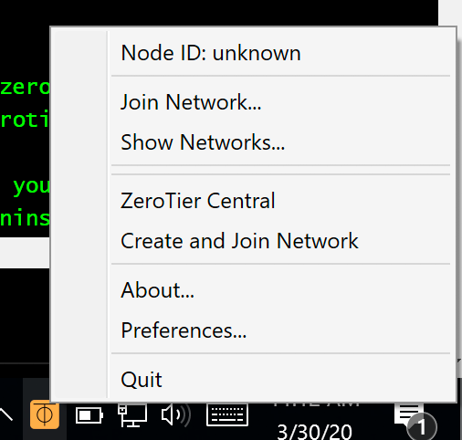
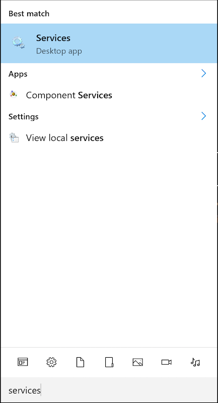
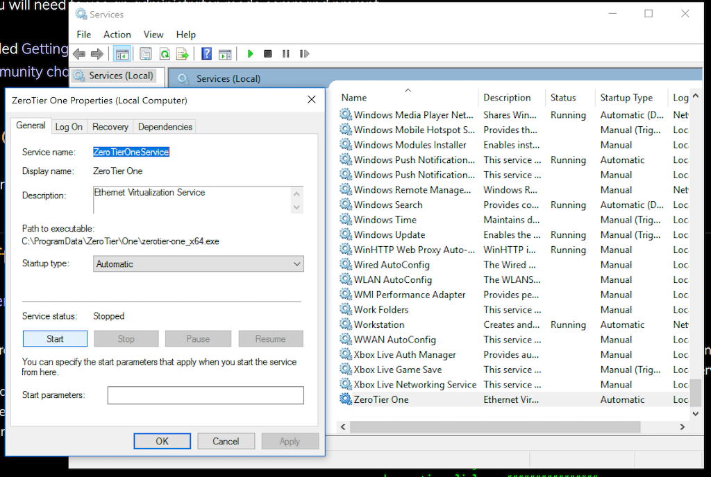
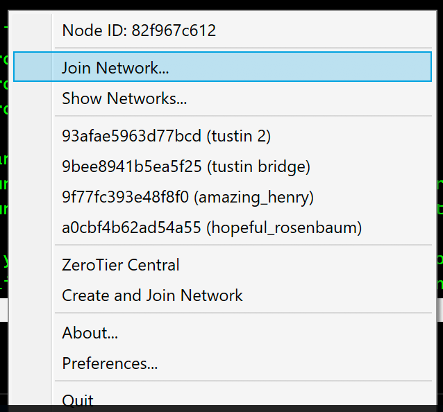

Is the Windows ZeroTier tray app saying "Unknown" for the Node ID? That means the ZeroTier One system service isn't running for some reason. Here's how to turn it back on.

- Open the Start Menu
- Start typing "services"
- Open Services (desktop app)
- Find ZeroTier One at the bottom of the list
- Start it

If for some reason the tray app still can't connect, you can still manage your device's joined networks with, see: [CLI Help](./cli.md)
